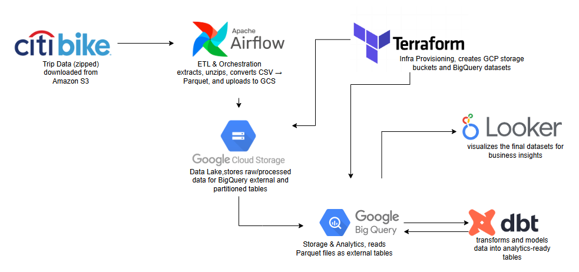
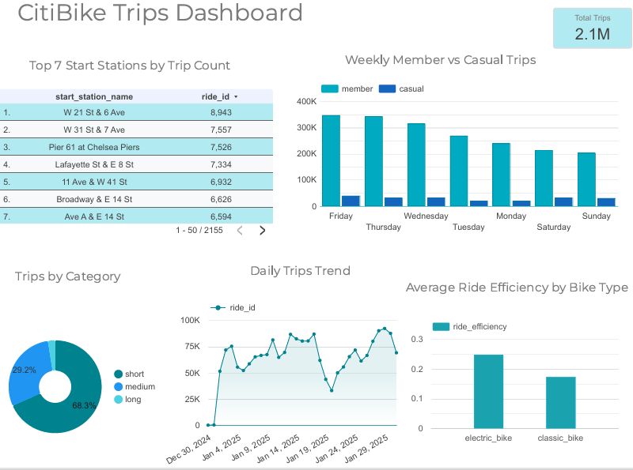

# 🚲 CitiBike Trip Data – End-to-End Data Pipeline

## 1. Problem Description

CitiBike generates a large volume of trip data daily. However, this data is stored in raw and compressed formats, making it difficult to analyze directly.
The goal of this project is to design an end-to-end data pipeline that ingests, processes, and transforms this data into a structured format, enabling efficient analysis.
A dashboard will be built to provide key insights such as trip trends, station usage, and rider behavior, helping city planners and analysts make data-driven decisions.


## 📅 Data Analysis Period
**December 30, 2024 – January 31, 2025**

## 📂 Data Source
The raw data used in this project comes from **Citi Bike’s public trip data repository**.

- The data is **publicly available**
- It is provided as **compressed ZIP files**
- Each file contains detailed records of Citi Bike trips for a given month

### 🔗 Official Source
The dataset for this analysis was downloaded directly from the official Citi Bike S3 bucket:

- **Source URL:** https://s3.amazonaws.com/tripdata/202501-citibike-tripdata.zip


### 📄 Dataset Fields

The dataset includes the following attributes:

- Ride ID  
- Rideable type  
- Started at  
- Ended at  
- Start station name  
- Start station ID  
- End station name  
- End station ID  
- Start latitude  
- Start longitude  
- End latitude  
- End longitude  
- Member or casual rider type


## 2. Business Questions

1. What is the total number of CitiBike trips during the analysis period?
2. Which start stations generate the highest number of trips?
3. How does ride efficiency differ between electric bikes and classic bikes?
4. What is the distribution of trips by ride duration category (short, medium, long)?
5. How does daily trip volume evolve over time?
6. How do trips compare between members and casual users?


## 3. Project Objectives

The objectives of this project are to:

- Prepare and store raw CitiBike trip data in Google Cloud Storage (GCS)
- Organize the raw data into a structured data lake layout
- Load the data into BigQuery as partitioned and clustered tables
- Optimize data for analytical queries and performance
- Build dashboards to visualize key metrics and insights


## 4. 🛠️ Technology Overview

1. **Terraform** provisions infrastructure on GCP (VM, storage buckets, datasets).  
2. **Airflow** runs ETL: downloads CitiBike ZIP files, unzips, converts CSV to Parquet, uploads to **GCS**.  
3. **BigQuery** reads data from **GCS**, creating external tables, then partitioned & clustered tables.  
4. **dbt** applies transformations and builds analytical views for reporting.  
5. **Looker Studio** visualizes insights using the transformed data.  


## 6. High-Level Architecture



## 7. Project Structure

```
citibike-data-pipeline/
│
├── Dockerfile
├── README.md
├── SetupProject.md
├── airflow_settings.yaml
├── dags 
│   ├── citibike_dbt_pipeline.py
│   ├── citibike_to_gcs_2025.py
│   └── gcs_to_bigquery_2025.py
├── dbt_env
├── .dbt
│   ├── citibike_dbt_gcp
│   └── profiles.yml
│   
├── images
├── include
├── logs
├── packages.txt
├── plugins
├── requirements.txt
├── terraform
│   ├── main.tf
│   └── variables.tf
└── tests
    └── dags

```

## 7. 📊 Data Visualizations

Data visualizations for this project can be accessed [here](https://lookerstudio.google.com/reporting/8b4b0a39-9df0-4788-83d2-1aa8bd57524f).  




## 8. 🔄 Reproduce Project

To reproduce the project and test the code yourself, follow these steps.  
For a complete step-by-step guide, you can access it [here](SetupProject.md).
