# CitiBike Data Pipeline — Setup Guide (Professional)

> End-to-end Data Engineering pipeline using GCP, Terraform, Astro Airflow, dbt, BigQuery and dashboard


## 1️⃣ Prerequisites

- GCP Project created (note Project ID)
- Service account JSON with **Storage Admin** & **BigQuery Admin** roles
- VM ready with:
  - Ubuntu 22.04
  - Docker
  - Docker Compose
  - Terraform
  - Anaconda
- SSH configured for VM access


## 2️⃣ Complete Ubuntu Environment Setup

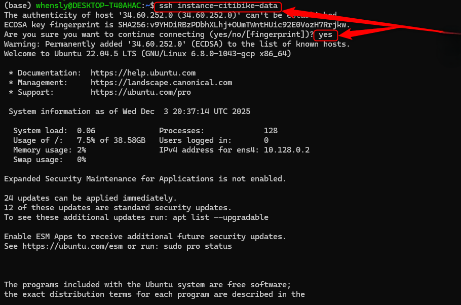

Once you successfully SSH into the VM, this is the checkpoint where you must ensure all required tools are installed and properly configured. At this stage, verify that Docker, Docker Compose, Terraform, Anaconda, and gcloud are available, that the Conda base environment is active, and that Google Cloud credentials are correctly set via environment variables. This guarantees the VM is fully prepared to run Terraform, Astro/Airflow, GCS, BigQuery, and dbt without issues throughout the project.

Ensure your VM has a stable environment for all tools:

```bash
# Add custom bin to PATH
export PATH="$HOME/bin:$PATH"

# Activate conda automatically
source ~/anaconda3/bin/activate

# Google credentials
export GOOGLE_APPLICATION_CREDENTIALS="$HOME/.google/credentials/google_credentials.json"
````

Reload and verify:

```bash
source ~/.bashrc
echo $PATH
echo $GOOGLE_APPLICATION_CREDENTIALS
conda info --envs
```

## 3️⃣ Clone Project & Prepare Credentials

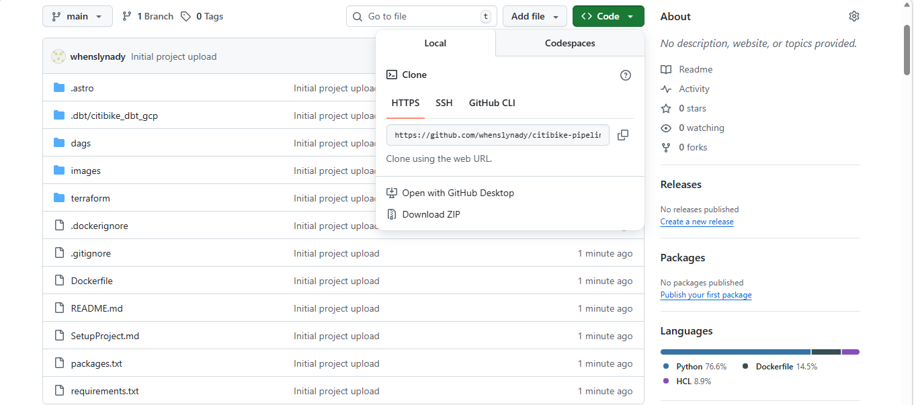

```bash
git clone https://github.com/whenslynady/citibike-pipeline.git
cd citibike-pipeline
```

Create credentials for Astro + Airflow:

```bash
mkdir -p ~/citibike-pipeline/.google/credentials
cp ~/.google/credentials/google_credentials.json \
   ~/citibike-pipeline/.google/credentials/google_credentials.json
```

> ⚠️ Make sure to add .google/credentials/google_credentials.json to your .gitignore file.

## 4️⃣ Prepare Terraform Infrastructure

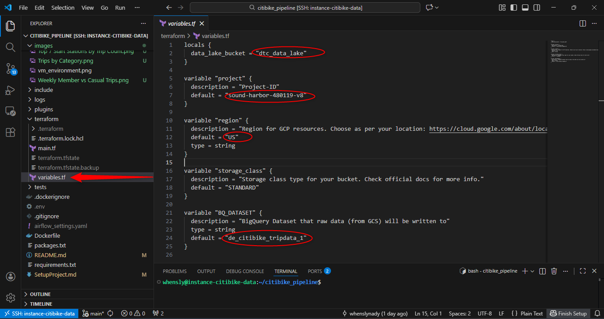

```bash
cd citibike_pipeline/terraform
```

Update `variables.tf`:

* `project` → GCP project ID
* `region` → multi-region
* `data_lake_bucket` → GCS bucket
* `BQ_DATASET` → BigQuery dataset


### Terraform Setup and Execution

Run the following commands:

```bash
terraform init
terraform apply
```
When it prompts you just type "yes"

✅ Creates:

* GCS Data Lake bucket
* BigQuery dataset
* IAM permissions

## 6️⃣ Dockerfile Environment Variables

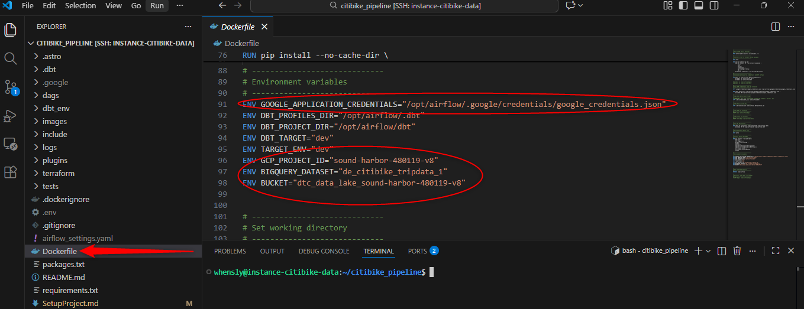

```dockerfile
# Airflow / Google Cloud settings
ENV GOOGLE_APPLICATION_CREDENTIALS="/opt/airflow/.google/credentials/google_credentials.json"

# Required environment variables (replace with your own values)
ENV GCP_PROJECT_ID="<YOUR_GCP_PROJECT_ID>"
ENV BIGQUERY_DATASET="<YOUR_BIGQUERY_DATASET>"
ENV BUCKET="<YOUR_GCS_BUCKET>"

```

## 7️⃣ Astro + Airflow Setup

```bash
cd ~/citibike_pipeline
astro dev start
```
> ⚠️ The first time you run this, it may take a while to start.
> You might want to grab a cup of coffee or lunch ☕️🍴

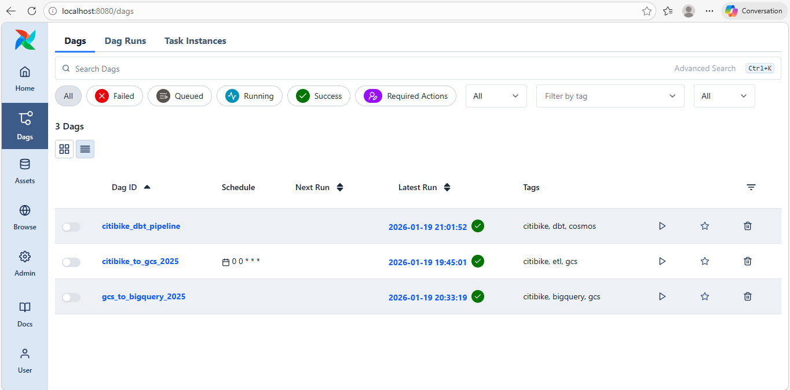

> Airflow UI showing active CitiBike DAGs running locally via Astro


### 🔌 Forward Port 8080 in Visual Studio Code

To access Airflow UI locally, you need to forward port 8080 in VS Code:

1. Open **Remote Explorer** or **Ports**
2. Find port **8080**
3. Click **Forward** or **Add Port**

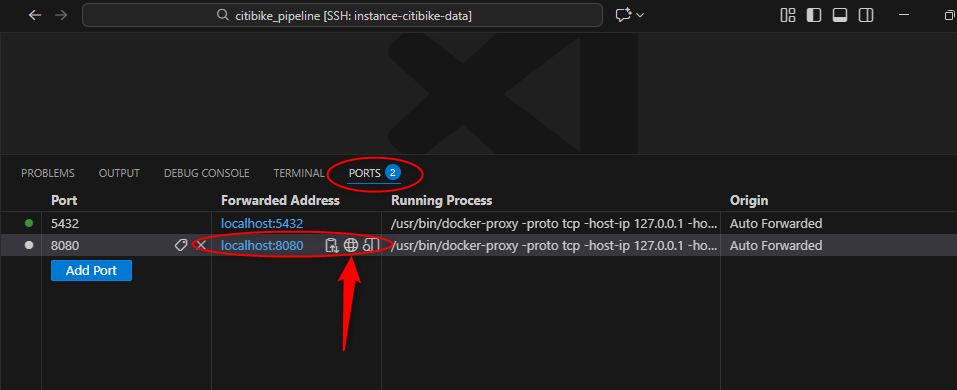

* Airflow UI: [http://localhost:8080](http://localhost:8080)
* Username: `admin`
* Password: `admin`

## 8️⃣ DAG Architecture Overview

Each stage of the pipeline is orchestrated using a **separate Airflow DAG**, following data engineering best practices.

### 🔹 GCS Ingestion DAG

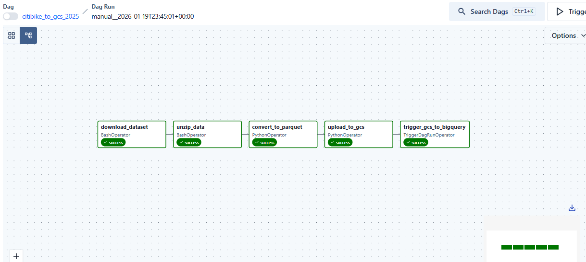

> Extract raw CitiBike data → convert to Parquet → upload to GCS Data Lake.

**Responsibilities:**
- Download raw CitiBike data
- Data validation & schema enforcement
- Convert CSV → Parquet
- Upload files to Google Cloud Storage

### 🔹 BigQuery Load DAG

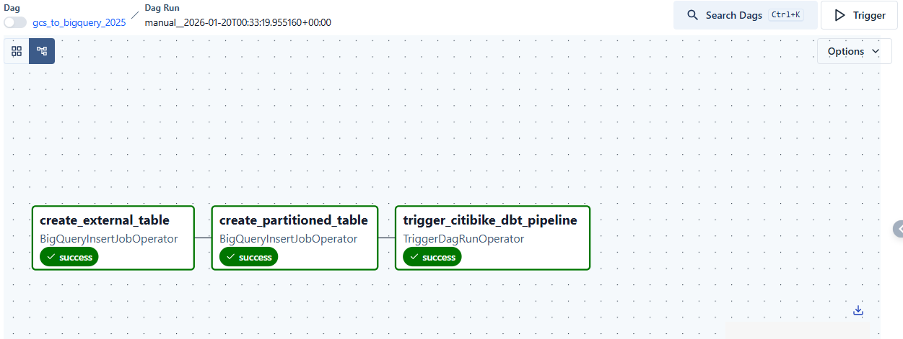

> Load Parquet files from GCS → create external tables → apply partitioning & clustering.

**Responsibilities:**
- Create external tables in BigQuery
- Partition tables by date
- Apply clustering for performance
- Validate row counts & schemas

### 🔹 dbt Transformation DAG

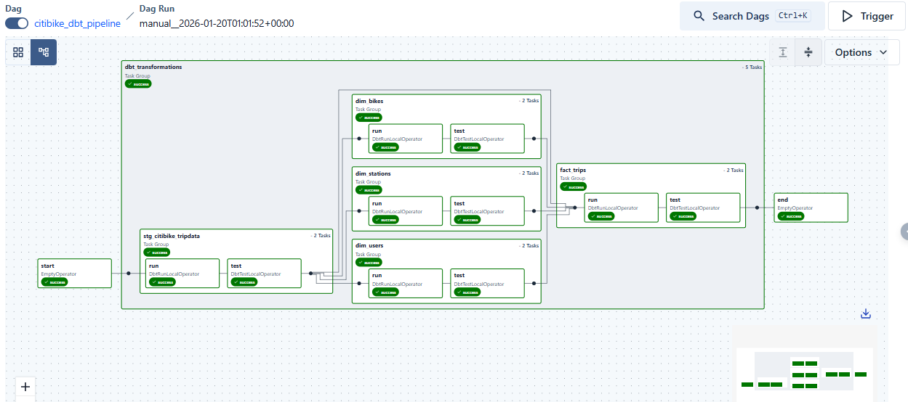

> Transform raw data into analytics-ready models (Staging → Dim → Fact).

**Responsibilities:**
- Run dbt models inside Airflow
- Apply data tests (not null, unique, relationships)
- Build dimensional & fact tables
- Produce analytics-ready datasets

## 📊 Analytics Reports

Here are the analytics dashboards created for this project:

#### 1️⃣ Top 7 Start Stations by Trip Count  
Shows the most frequently used start stations based on total trip volume.

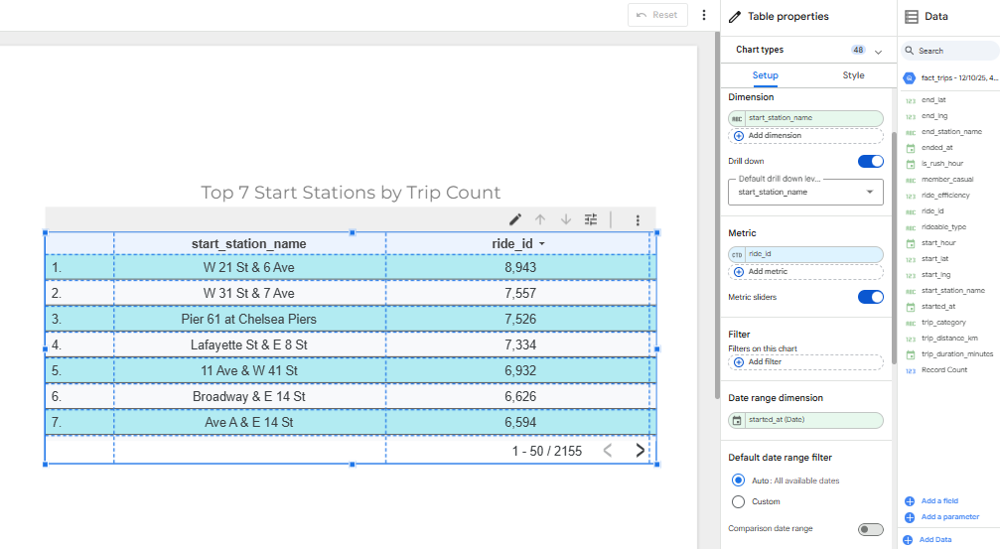

#### 2️⃣ Weekly Member vs Casual Trips  
Compares weekly ride activity between **members** and **casual riders**.

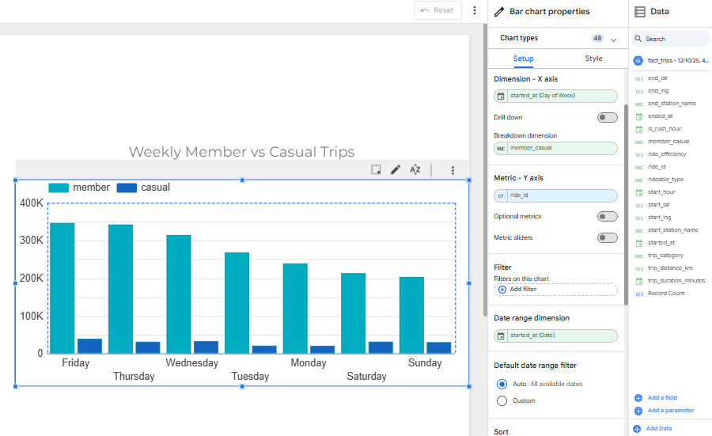

#### 3️⃣ Trips by Category  
Breakdown of trips by user or ride category to highlight usage patterns.

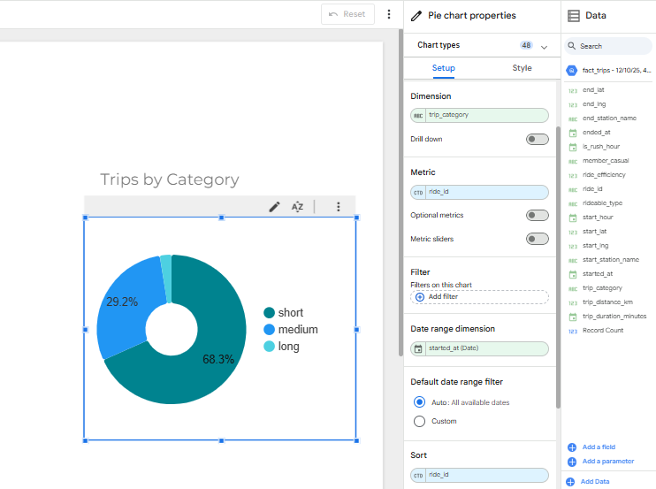

#### 4️⃣ Daily Trips Trend  
Displays the daily trend of trips over time to identify peaks and seasonality.

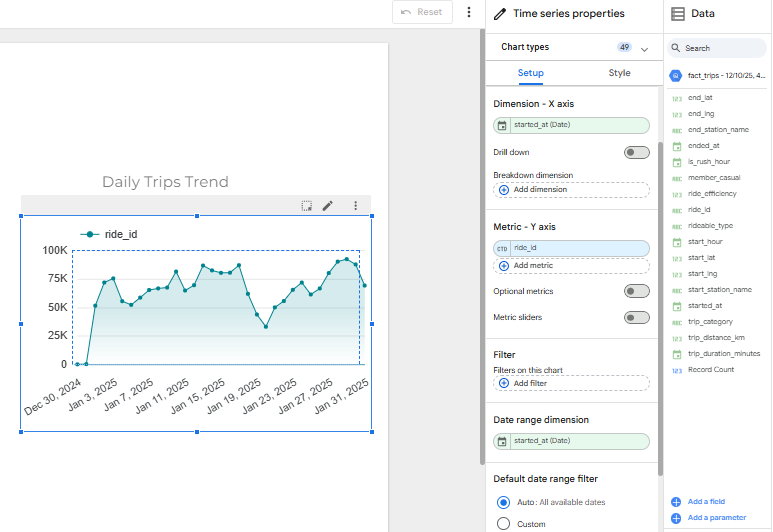

#### 5️⃣ Average Ride Efficiency by Bike Type  
Bar chart showing average ride efficiency grouped by **bike type**.

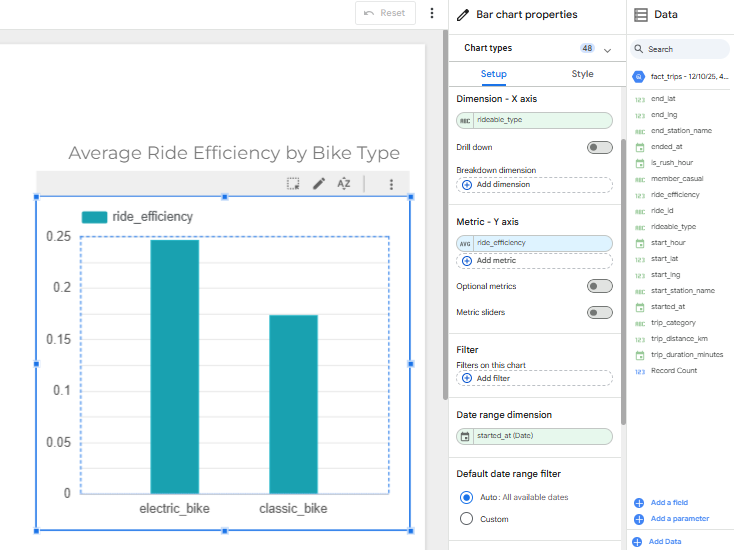

> 📘 **Note:** All visualizations were built using transformed data from BigQuery and designed in Looker Studio to support analytical decision-making.
